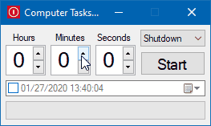
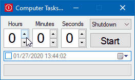

# Computer Tasks Timer

A tool to easily set timer for your computer to lock, shutdown, restart, etc. or to select a specific date and time in the future to perform one of the tasks.

## Available Tasks

* Shutdown
* Restart
* Lock
* Sleep
* Hibernate
* Screen off
* Screen off with lock
* Sign out

## Optional Command Line Arguments

1. The number of seconds to set the timer to.
2. The name of the task from the following list: `Shutdown`, `Restart`, `Lock`, `Sleep`, `Hibernate`, `ScreenOff`, `ScreenOffAndLock`, `SignOut`.

For example, the arguments `3600 Restart` will set the computer to restart in one hour.

## Screenshots

Set timer:

Or select exact date and time:

