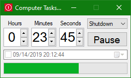

# Computer Tasks Timer

A tool to easily set timer for your computer to lock, shutdown, restart, etc. or to select a specific date and time in the future to perform one of the tasks.

## Available Tasks

0. Shutdown
1. Restart
2. Lock
3. Sleep
4. Hibernate
5. Screen off
6. Screen off with lock
7. Sign out

## Command Line Arguments (Optional)

The first argument is the number of seconds to set the timer to.
The second argument is the index of the task (zero-based according to the list above. Default index is 0).

For example, the arguments `3600 1` will set the computer to restart in one hour.

## Screenshot

